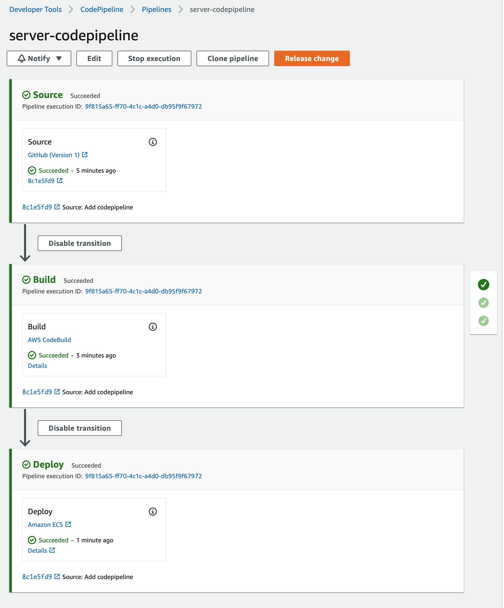
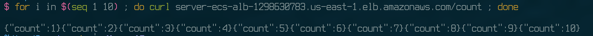

# A Simple Web Service Deployed on AWS ECS Fargate via AWS CodePipeline

This is a simple web service written in Go, that returns the number of count when accessing `/count` endpoint.

The infrastructure all done by Terraform as IaC, and using
- AWS ECS Fargate for hosting the service
- AWS ECR to store docker images
- AWS CodeBuild to build a docker image when changes are pushed to the repository (via GitHub Oauth Token)
- AWS CodePipeline to deploy the new container on AWs ECS

The folder structure is shown as

```
├── Dockerfile
├── Makefile
├── buildspec.yml
├── doc
│   ├── codepipeline.png
│   └── output.png
├── src
│   ├── go.mod
│   ├── main.go
│   └── main_test.go
└── tf
    ├── backend.tf
    ├── codebuild.tf
    ├── codepipeline.tf
    ├── ecr.tf
    ├── ecs.tf
    ├── provider.tf
    ├── variables.tf
    └── vpc.tf
```


### Tasks

The following tasks are available to this project

- docker build - `make docker_build`
- terraform init - `make tf_init`
- terraform plan - `make tf_plan`
- terraform apply - `make tf_apply`
- terraform destroy - `make tf_destroy`


### Output



